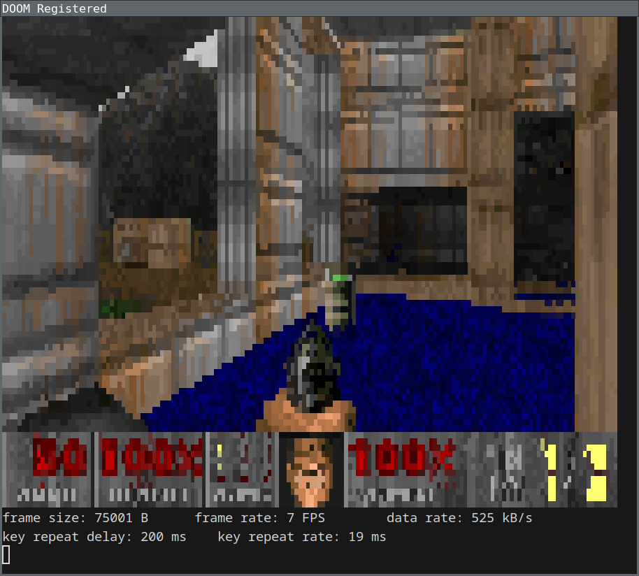

# doom-cli

**doom-cli** is a port of Doom that renders on the command-line.



It uses [Unicode block characters](https://en.wikipedia.org/wiki/Box-drawing_characters#Block_Elements) and [ANSI escape codes](https://en.wikipedia.org/wiki/ANSI_escape_code) to draw a (relatively) high fidelity screen inside an ordinary ANSI terminal. The game heuristically determines key repeat delay in order to simulate key release events. It even works over SSH!

This port is based on the excellent [doomgeneric](https://github.com/ozkl/doomgeneric). It should work with any reasonable C compiler. It was built for [Onramp](https://github.com/ludocode/onramp) so you can compile and run it even on a system that has no C compiler, no make tool, no libc headers, etc.

doom-cli supports several graphics modes. It is configured by choosing a character set and a color mode; see the Options section below. If the graphics are corrupted on your terminal, try lowering them or using an alternate terminal.

The game works well in [Alacritty](https://alacritty.org/) with an appropriate font. I haven't tested many other terminals.


## Quick Start

You'll need a POSIX system, a C compiler, a [Doom wad](https://en.wikipedia.org/wiki/Doom_WAD), and either a `make` tool or a POSIX shell. The shareware Doom wad is free and available online.

Build with `make` like this:

```sh
cd doomgeneric
make -f Makefile.cli
```

Or with a POSIX shell like this:

```sh
cd doomgeneric
./build-cli.sh
```

If you want to build with Onramp, you'll need to `export CC=onrampcc` first.

You can then run the game like this:

```sh
./doomgeneric -iwad /path/to/DOOM.WAD
```

If you're getting graphics corruption, your terminal likely does not support the default character set or color mode. Try lowering them, e.g. `-charset half` or `-color 8bit`. See the Options section below.


## Controls

- arrow keys: move around
- `z`: shoot
- `x`: strafe (but see note below)
- spacebar: open doors, activate switches
- enter: activate menu options
- 1-7: choose weapon

Note: You can only hold one key at a time. You can sort of simulate holding two keys by rapidly alternating tapping them. For example, rapidly tap `x` and an arrow key to strafe, and rapidly tap `z` and up to shoot while running.

Key release events are simulated so you may find the controls painful especially if you have a high key repeat delay. The controls will feel much more crisp if you reduce your key repeat delay. See the Input section below.


## Options

Character sets:

- `-charset sextant` -- Renders with [Unicode block sextant characters](https://en.wikipedia.org/wiki/Symbols_for_Legacy_Computing#Block) (🬗🬊🬶🬑). This is six pixels per character. It requires special fonts and a terminal that supports non-BMP characters so platform support is very limited. This is the default mode.
- `-charset quadrant` -- Renders with [Unicode quadrant characters](https://en.wikipedia.org/wiki/Block_Elements) (▙▚▟). This is four pixels per character. This still requires special fonts but the charset is in the BMP so it may be available in more terminals than sextant mode.
- `-charset half` -- Renders with the [Unicode upper half block character](https://en.wikipedia.org/wiki/Block_Elements) (▀), as well as the lower half block in non-color mode. This is two pixels per character. This is much more likely to be supported by your terminal as this character has been around since at least [code page 437](https://en.wikipedia.org/wiki/Code_page_437).
- `-charset space` -- Renders with only a space character. The lowest fidelity mode, but guaranteed to be supported. Incompatible with the non-color modes.

Color modes:

- `-color 24bit` -- Renders with full 24-bit color. The best quality but transmits a lot of data and requires a modern terminal. This may cause excessive flickering. This is the default mode.
- `-color 8bit` -- Renders with [8-bit color](https://en.wikipedia.org/wiki/ANSI_escape_code#8-bit), making use of the 6x6x6 color cube and the 24-shade grayscale colors.
- `-color 4bit` -- Renders with the [4-bit color palette](https://en.wikipedia.org/wiki/ANSI_escape_code#3-bit_and_4-bit), assuming VGA colors.
- `-color 3bit` -- Renders with the [3-bit color palette](https://en.wikipedia.org/wiki/ANSI_escape_code#3-bit_and_4-bit). Uses only the 8 original (non-bright) colors.
- `-color light` -- Non-color mode, assuming a light theme, light-colored background and dark text. No ANSI color escape sequences will be emitted.
- `-color dark` -- Non-color mode, assuming a dark theme, i.e. dark-colored background and light text. No ANSI color escape sequences will be emitted.

(Note: Only the 24bit color mode works well at the moment. 8bit kind of works, 4bit and 3bit are buggy, and light and dark are basically unplayable.)

Scale filtering modes:

- `-filter box` -- Scales using a simple separable box filter. The default unless compiling for Onramp.
- `-filter nearest` -- Scales by selecting the nearest pixel.

Noise:

- `-noise on` -- Enables noise. This is the default (but see noise strength below.)
- `-noise off` -- Disables noise.
- `-noise-speed N` -- Sets the delay between changing noise textures to N milliseconds. The default is 75.
- `-noise-strength N` -- Sets the strength of noise to N percent. The default depends on the color mode. (The default is 0 for 24-bit color mode which disables noise.)

Additional options:

- `-columns N` -- Renders to width of N character columns. The default is 80.
<!-- - `-stats` -- Print statistics. TODO some of this is on by default; not sure if we want to keep this. -->


## Graphics

To render a frame, the game internally draws to a 320x200 offscreen surface. The frame is then scaled to the display columns and rows, multiplied by the number of pixels per character in each direction. The scaling corrects the aspect ratio to 4x3, assuming a 4x9 terminal font. At the default 80 column width this is 26 rows tall.

ANSI escape codes support setting both the foreground and background color of a character, so we can have two colors per character. In the space mode, only the background color is used. In the half mode, the upper half is the foreground color and the lower half is the background color.

In the quadrant and sextant modes, there are four or six pixels per character but only two colors. We separate the pixels into two groups based on luminosity. The bright pixels are averaged to form the foreground color and the dark pixels are averaged to form the background color.

In the 8-bit and lower color modes, we add blue noise to the color, then select the closest available color from the selected palette.


## Sound

Nope.


## Input

The input mechanism heuristically determines the key repeat delay and key repeat rate in order to simulate key up events.

For each key, we keep track of the time between presses in a circular buffer. If we detect a sequence of closely matching time differences, we can assume this is the repeat rate and the initial time difference is the repeat delay. There is some additional filtering to avoid detecting quick taps as repeats.

We also track the assumed state of each key, i.e. whether we believe the last press is a genuine press or a repeat. We can therefore determine how long we should wait before generating a key release. This time is capped in order to keep the game somewhat playable with larger repeat delays.
